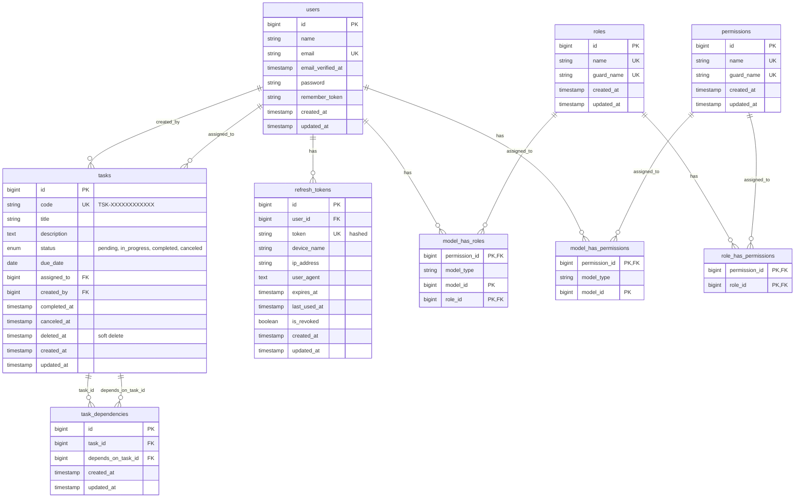

# Entity Relationship Diagram (ERD)

## Interactive ERD

An interactive version of this ERD is available at:
- **URL**: [https://dbdocs.io/m.ayman1924/task-manager](https://dbdocs.io/m.ayman1924/task-manager)
- **Password**: `password`

---

## Task Management System Database Schema

### Complete ERD Diagram

## Database Tables Description

### Core Tables

#### 1. `users`
Stores user account information.

**Key Fields:**
- `id`: Primary key
- `email`: Unique email address
- `password`: Hashed password
- `name`: User's full name

**Relationships:**
- One-to-Many with `tasks` (as creator: `created_by`)
- One-to-Many with `tasks` (as assignee: `assigned_to`)
- One-to-Many with `refresh_tokens`
- Many-to-Many with `roles` (via `model_has_roles`)
- Many-to-Many with `permissions` (via `model_has_permissions`)

#### 2. `tasks`
Stores task information.

**Key Fields:**
- `id`: Primary key
- `code`: Unique task code (TSK-XXXXXXXXXXXX)
- `title`: Task title
- `description`: Task description
- `status`: Task status (pending, in_progress, completed, canceled)
- `due_date`: Task due date
- `assigned_to`: Foreign key to `users.id` (nullable)
- `created_by`: Foreign key to `users.id` (required)
- `completed_at`: Timestamp when task was completed
- `canceled_at`: Timestamp when task was canceled
- `deleted_at`: Soft delete timestamp

**Indexes:**
- `idx_tasks_code`: Index on `code`
- `idx_tasks_status`: Index on `status`
- `idx_tasks_due_date`: Index on `due_date`
- `idx_tasks_assigned_to`: Index on `assigned_to`
- `idx_tasks_created_by`: Index on `created_by`
- `idx_tasks_status_due_date`: Composite index on `status` and `due_date`
- `idx_tasks_assigned_status`: Composite index on `assigned_to` and `status`
- `idx_tasks_fulltext`: Full-text index on `title` and `description`

**Relationships:**
- Many-to-One with `users` (creator)
- Many-to-One with `users` (assignee)
- Many-to-Many with `tasks` (dependencies via `task_dependencies`)

#### 3. `task_dependencies`
Pivot table for task dependencies (many-to-many relationship).

**Key Fields:**
- `id`: Primary key
- `task_id`: Foreign key to `tasks.id` (the task that depends on others)
- `depends_on_task_id`: Foreign key to `tasks.id` (the task that must be completed first)

**Constraints:**
- Unique constraint on `(task_id, depends_on_task_id)` to prevent duplicates
- Self-dependency prevention handled at application level
- Circular dependency prevention handled at application level

**Indexes:**
- `idx_task_dependencies_unique`: Unique index on `(task_id, depends_on_task_id)`
- `idx_task_dependencies_task_id`: Index on `task_id`
- `idx_task_dependencies_depends_on`: Index on `depends_on_task_id`

#### 4. `refresh_tokens`
Stores refresh tokens for authentication.

**Key Fields:**
- `id`: Primary key
- `user_id`: Foreign key to `users.id`
- `token`: Hashed refresh token (unique)
- `device_name`: Device identifier
- `ip_address`: IP address when token was created
- `user_agent`: User agent when token was created
- `expires_at`: Token expiration date
- `last_used_at`: Last time token was used
- `is_revoked`: Whether token is revoked

**Indexes:**
- `idx_refresh_tokens_user_id`: Index on `user_id`
- `idx_refresh_tokens_token`: Index on `token`
- `idx_refresh_tokens_expires_at`: Index on `expires_at`
- `idx_refresh_tokens_user_revoked`: Composite index on `user_id` and `is_revoked`

### Authorization Tables (Spatie Laravel Permission)

#### 5. `roles`
Stores user roles (Manager, User).

**Key Fields:**
- `id`: Primary key
- `name`: Role name (unique with guard_name)
- `guard_name`: Guard name (usually 'web')

#### 6. `permissions`
Stores system permissions.

**Key Fields:**
- `id`: Primary key
- `name`: Permission name (unique with guard_name)
- `guard_name`: Guard name (usually 'web')

**Example Permissions:**
- `tasks.create`
- `tasks.view`
- `tasks.view.all`
- `tasks.view.own`
- `tasks.update`
- `tasks.update.own`
- `tasks.update.status`
- `tasks.update.status.own`
- `tasks.delete`
- `tasks.assign`

#### 7. `model_has_roles`
Pivot table for user-role assignments.

**Key Fields:**
- `role_id`: Foreign key to `roles.id`
- `model_type`: Model type (usually 'App\Models\User')
- `model_id`: Foreign key to `users.id`

#### 8. `model_has_permissions`
Pivot table for user-permission assignments (direct permissions).

**Key Fields:**
- `permission_id`: Foreign key to `permissions.id`
- `model_type`: Model type (usually 'App\Models\User')
- `model_id`: Foreign key to `users.id`

#### 9. `role_has_permissions`
Pivot table for role-permission assignments.

**Key Fields:**
- `role_id`: Foreign key to `roles.id`
- `permission_id`: Foreign key to `permissions.id`

## Relationships Summary

### One-to-Many Relationships

1. **User → Tasks (Creator)**
   - One user can create many tasks
   - Foreign key: `tasks.created_by` → `users.id`
   - On delete: RESTRICT (cannot delete user who created tasks)

2. **User → Tasks (Assignee)**
   - One user can be assigned to many tasks
   - Foreign key: `tasks.assigned_to` → `users.id`
   - On delete: SET NULL (task remains but assignee is cleared)

3. **User → Refresh Tokens**
   - One user can have many refresh tokens
   - Foreign key: `refresh_tokens.user_id` → `users.id`
   - On delete: CASCADE

### Many-to-Many Relationships

1. **Tasks ↔ Tasks (Dependencies)**
   - One task can depend on many tasks
   - One task can be a dependency for many tasks
   - Pivot table: `task_dependencies`
   - Foreign keys:
     - `task_dependencies.task_id` → `tasks.id`
     - `task_dependencies.depends_on_task_id` → `tasks.id`
   - On delete: CASCADE (if task is deleted, dependencies are removed)

2. **Users ↔ Roles**
   - One user can have many roles
   - One role can be assigned to many users
   - Pivot table: `model_has_roles`

3. **Users ↔ Permissions**
   - One user can have many permissions (direct)
   - One permission can be assigned to many users
   - Pivot table: `model_has_permissions`

4. **Roles ↔ Permissions**
   - One role can have many permissions
   - One permission can be assigned to many roles
   - Pivot table: `role_has_permissions`

## Business Rules

### Task Dependencies

1. **Self-Dependency Prevention**: A task cannot depend on itself
   - Enforced at application level (not in database)

2. **Circular Dependency Prevention**: Cannot create circular dependencies
   - Example: Task A depends on Task B, Task B depends on Task A
   - Enforced at application level using recursive checking

3. **Completion Rule**: A task cannot be completed until all its dependencies are completed
   - Enforced at application level in `TaskService::updateTaskStatusByCode()`

4. **Duplicate Prevention**: Cannot add the same dependency twice
   - Enforced at database level (unique constraint on `task_dependencies`)

### Data Integrity

1. **Soft Deletes**: Tasks use soft deletes (`deleted_at` column)
   - Deleted tasks are not physically removed from database
   - Can be restored if needed

2. **Status Constraints**: Task status must be one of: pending, in_progress, completed, canceled
   - Enforced at database level (ENUM constraint)

3. **Timestamps**: 
   - `completed_at` is set when status changes to 'completed'
   - `canceled_at` is set when status changes to 'canceled'

## Indexes for Performance

### Tasks Table
- `idx_tasks_code`: Fast lookup by task code
- `idx_tasks_status`: Fast filtering by status
- `idx_tasks_due_date`: Fast filtering by due date
- `idx_tasks_assigned_to`: Fast filtering by assigned user
- `idx_tasks_status_due_date`: Composite index for status + due date queries
- `idx_tasks_assigned_status`: Composite index for assigned user + status queries
- `idx_tasks_fulltext`: Full-text search on title and description

### Task Dependencies Table
- `idx_task_dependencies_task_id`: Fast lookup of dependencies for a task
- `idx_task_dependencies_depends_on`: Fast lookup of tasks that depend on a specific task

### Refresh Tokens Table
- `idx_refresh_tokens_user_id`: Fast lookup of tokens for a user
- `idx_refresh_tokens_token`: Fast token validation
- `idx_refresh_tokens_expires_at`: Fast cleanup of expired tokens
- `idx_refresh_tokens_user_revoked`: Fast lookup of active tokens for a user

## Notes

- All foreign keys use `onUpdate('cascade')` to maintain referential integrity
- Task dependencies use `onDelete('cascade')` to automatically remove dependencies when a task is deleted
- User assignments use `onDelete('set null')` to preserve tasks when a user is deleted
- Task creators use `onDelete('restrict')` to prevent deletion of users who created tasks

---

**Generated for:** Task Management System API  
**Database:** MySQL  
**Framework:** Laravel 12.0

